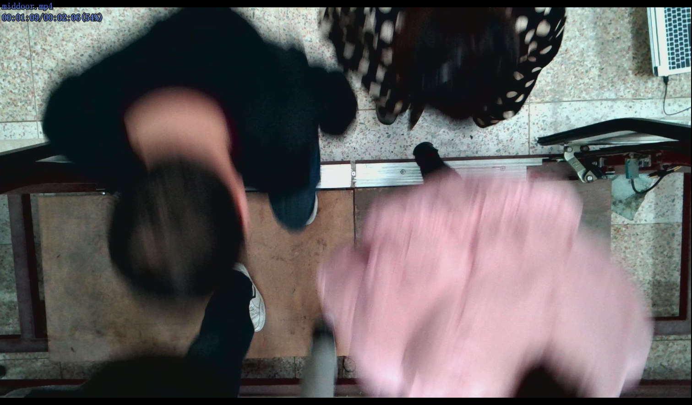

# A project about yolov5 and deepsort to count objects in video

## Background

**对于一个如下场景的监控视频（摄像头安装在门框正上方），需要统计出视频中进出门的人数。**



```
直接使用yolov5的预训练权重去检测效果很差，因此选择使用yolov5的预训练权重在SCUT-HEAD头部检测数据集做finetuning，最后再结合deepsort和画线检测策略完成对人数的统计。
```

## Requirements

```
# pip install -r requirements.txt
# 对于Windows下pycocotools的安装需要用如下命令：
# pip install pycocotools-windows -i https://pypi.tuna.tsinghua.edu.cn/simple

# base ----------------------------------------
matplotlib>=3.2.2
numpy>=1.18.5
opencv-python>=4.1.2
Pillow
PyYAML>=5.3.1
scipy>=1.4.1
torch>=1.7.0
torchvision>=0.8.1
tqdm>=4.41.0

# logging -------------------------------------
tensorboard>=2.4.1
# wandb

# plotting ------------------------------------
seaborn>=0.11.0
pandas

# export --------------------------------------
# coremltools>=4.1
# onnx>=1.8.1
# scikit-learn==0.19.2  # for coreml quantization

# extras --------------------------------------
thop  # FLOPS computation
pycocotools>=2.0  # COCO mAP
```

## DirTree

```
yolov5-deep_sort
├─deep_sort
│  ├─configs
│  │  └─deepsort.yaml #deepsort配置文件
│  ├─deep_sort
│  │  ├─deep
│  │  │  ├─checkpoint #deepsort的ReID网络权重
│  │  │  ├─train_data #训练数据Market-1501数据集
│  │  │  ├─evaluate.py #ReID网络评估脚本
│  │  │  ├─feature_extractor.py #特征提取器代码
│  │  │  ├─model.py #ReID网络模型定义代码
│  │  │  ├─prepare_car.py #整理车辆数据集脚本
│  │  │  ├─prepare_person.py #整理行人数据集脚本
│  │  │  ├─test.py #ReID网络测试脚本
│  │  │  ├─train.py #ReID网络训练脚本
│  │  ├─sort
│  │  │  ├─detection.py #Detection类定义代码
│  │  │  ├─iou_matching.py #IoU计算代码
│  │  │  ├─kalman_filter.py #卡尔曼滤波器代码
│  │  │  ├─linear_assignment.py #分配算法代码
│  │  │  ├─nn_matching.py #最近邻距离计算代码
│  │  │  ├─preprocessing.py #非极大抑制代码
│  │  │  ├─track.py #Track类定义代码
│  │  │  └─tracker.py #Tracker类定义代码
│  │  └─deepsort.py #DeepSORT类定义代码
│  └─utils #deepsort辅助工具代码
├─easydict #easydict包
├─models #yolov5 v5.0的models代码
├─utils #yolov5 v5.0的utils代码
├─test_data #测试的视频文件
├─weights #yolov5预训练权重及finetuning后的权重
├─count_car.py #车辆计数演示脚本
├─count_person.py #行人计数演示脚本--画线检测方法
├─count_personV2.py #行人计数演示脚本--比较前后帧同一目标框y值的方法
├─demo.py #多目标跟踪演示脚本
├─LICENSE #版权文件
├─objdetector.py #封装的yolov5检测器脚本
├─objtracker.py #封装的deepsort跟踪器脚本
└─requirements.txt #yolov5的依赖包列表文件
```

## How to use

> 以下内容，第1部分的代码未给出，只说明怎么做，详细训练见（先占坑，后续会写一下使用自己的数据集训练yolov5）
>
> 上述中的预训练权重和数据集都未上传到Github

1.下载yolov5代码及预训练权重，在SCUT-HEAD头部检测数据集上做finetuning。

- 在 https://github.com/ultralytics/yolov5/tree/v5.0 下载代码以及 https://github.com/ultralytics/yolov5/releases/tag/v5.0 预训练权重
- 在 https://aistudio.baidu.com/aistudio/datasetdetail/104969/0 下载好数据集，将其VOC(xml格式)转换成yolo(txt格式)，并划分好训练集和验证集
- 在yolov5-5.0-->data文件夹和yolov5-5.0-->models文件夹中分别准备好对应的数据和模型yaml配置文件，并修改配置参数
- 修改yolov5-5.0-->train.py文件中的--weight、--cfg、--data、--epochs、--batch-size、--img-size、--device参数，开始训练

2.将上一步训练得到的最优权重放在本项目的yolov5-deep_sort-->weights文件夹中，供deepsort使用

3.deepsort的特征提取网络模型可以使用Market-1501数据集去重新训练大约40轮（可选）

4.运行demo.py可查看行人检测+追踪的效果

5.运行count_person.py或count_personV2.py可查看检测+追踪+人数计数效果

## 总结

从测试结果来看，效果主要由以下几个方面决定：

- 检测的效率：yolov5的检测效率不是很高，在测试数据上效果不好。
- 追踪的效果：deepsort在追踪目标并赋予ID时，会存在同一目标前后两帧赋予不同ID的现象
- 画线检测或比较前后帧框的位置：选择不同的计数策略，得到的结果也不同

## 参考

```
1、炮哥带你学
https://blog.csdn.net/didiaopao/category_11321656.html
https://blog.csdn.net/didiaopao/category_11354220.html
2、SCUT-HEAD头部检测数据集
https://aistudio.baidu.com/aistudio/datasetdetail/104969/0
https://github.com/HCIILAB/SCUT-HEAD-Dataset-Release
3、Market-1501数据集（用于训练deepsort的特征提取网络模型）
4、Github
https://github.com/dyh/unbox_yolov5_deepsort_counting
https://github.com/Sharpiless/Yolov5-deepsort-inference
https://github.com/ultralytics/yolov5/
https://github.com/ZQPei/deep_sort_pytorch
```

